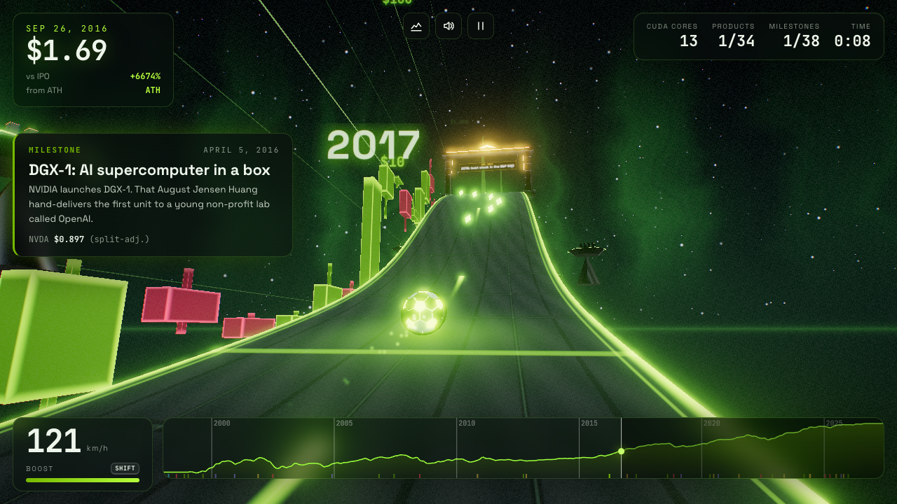
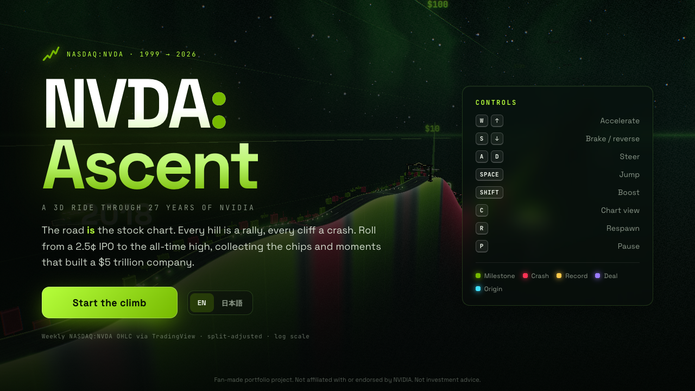
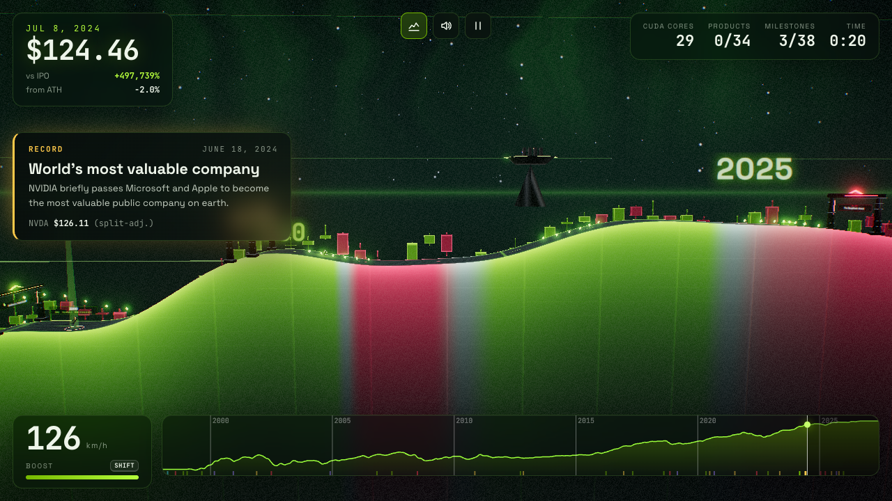
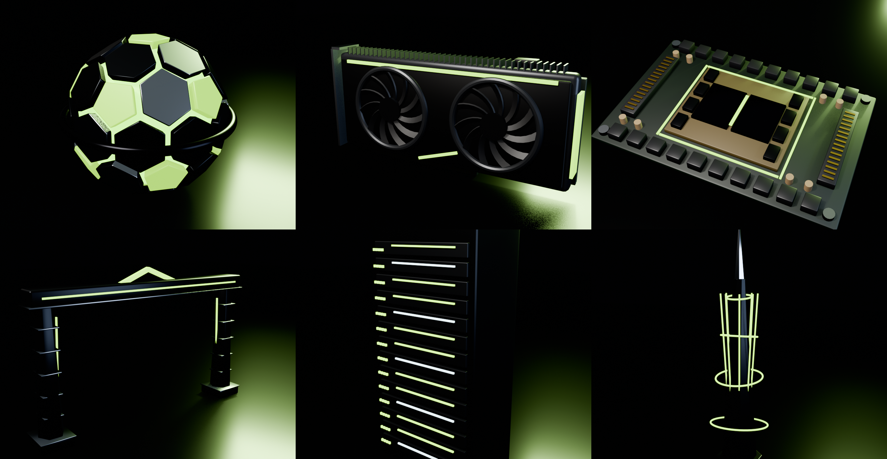

# NVDA: Ascent

### ▶ [Play in your browser → ukkari.github.io/nvda-ascent](https://ukkari.github.io/nvda-ascent/)

**A 3D game where NVIDIA's 27-year stock chart _is_ the race course.**
Roll a tensor-core orb from the 1999 IPO (2.5¢ split-adjusted) to the 2026 all-time high. Every hill is a rally, every cliff a crash. Along the way you collect the GPUs and accelerators that built a $5 trillion company and pass through gates marking the moments that shaped it.

**NVIDIA の 27 年分の株価チャートが、そのまま 3D のコースになったゲームです。** 上り坂は上昇相場、断崖は暴落。1999 年の IPO から 2026 年の史上最高値まで転がり登りながら、歴代の製品と歴史的な出来事を集めていきます。



| Title / attract mode | Chart view (press **C**) |
| --- | --- |
|  |  |

---

## Highlights

- **Real market data → terrain.** 1,446 weekly OHLC bars of `NASDAQ:NVDA` from TradingView become a log-scaled height field (8 m per week, 220 m per 10× in price). Log scale keeps both the 2002 −90% crash and the 2023 AI boom rideable.
- **Physically based rolling.** The grounded motion is integrated along the course profile, so the ball can't tunnel through the road. When a crest demands more centripetal acceleration than gravity can supply (`v²·κ > g·cosθ`), the ball launches into 3-D ballistic flight. Landings project velocity onto the slope, and hard impacts bounce with restitution.
- **History as level design.** 38 milestone gates (founding at Denny's → CUDA → AlexNet → ChatGPT → first $5T company) and 34 product pickups (RIVA TNT2 → Vera Rubin) are placed at their actual dates. Each gate triggers a story card with the split-adjusted price at that moment. All copy is bilingual (EN / 日本語).
- **The market drives the mood.** Drawdown from the all-time high tints the sky, fog, aurora and road neon from NVIDIA green to crimson, and the procedural soundtrack detunes toward a darker chord. "Bear market" and "New all-time high" events fire from the data itself.
- **Blender asset pipeline.** All six models are built by a headless, reproducible Blender script ([`blender/build_assets.py`](blender/build_assets.py)) and exported to glTF: a Goldberg-polyhedron player orb, a dual-fan graphics card, a dual-die SXM-style accelerator, the milestone gate, a server rack and the summit spire.
- **Performance-minded rendering.** About 1,450 candlesticks render in 2 instanced draw calls, and 1,200+ CUDA-core tokens in 1. Multi-material GLBs are converted into per-material `InstancedMesh`es for scenery, and props are culled by distance. Measured at ~58 fps in headless Chrome on a Mac laptop.
- **Custom shaders and post-processing.** The road, area-chart cliffs, sky dome, candles and particles use hand-written GLSL that shares one set of fog and market uniforms. The post chain is Unreal bloom followed by a speed-reactive lens pass (chromatic aberration, radial streaks, vignette, grain) and ACES tone mapping.
- **Zero audio files.** Rolling rumble, motor, wind, ambient pad and every chime are synthesised live with the Web Audio API.



## Controls

| Key | Action |
| --- | --- |
| `W` / `↑` | Accelerate |
| `S` / `↓` | Brake / reverse |
| `A` `D` / `←` `→` | Steer |
| `Space` | Jump |
| `Shift` | Boost (refills from CUDA cores and products) |
| `C` | Toggle chase cam / chart view |
| `R` | Respawn at last checkpoint |
| `P` / `Esc` | Pause |
| `M` | Mute |

Touch devices get on-screen controls with auto-throttle.

## Architecture

```
data/raw/            TradingView OHLCV dump (source of truth)
scripts/process_data.py   raw → public/data/nvda_weekly.json (columnar, 75 KB)
blender/build_assets.py   procedural models → public/models/*.glb + docs/assets_showcase.png
src/
  config.ts          world scale + physics tuning
  data/
    market.ts        price series, drawdowns, ATHs, date ↔ course-x mapping
    history.ts       milestones & products (EN / JA)
  world/
    Course.ts        height field (Gaussian + Catmull-Rom), slope/curvature, road & cliff meshes
    Candles.ts       instanced OHLC candlestick wall
    Gates.ts         milestone arches + holographic banners, checkpoints
    Pickups.ts       products + CUDA cores, windowed collision
    Backdrop.ts      log-price gridlines, year numerals, instanced era islands
    Sky.ts           procedural sky dome, aurora, stars
    uniforms.ts      shared shader uniforms (fog, regime, player)
  game/
    Game.ts          state machine, fixed-step loop (120 Hz), events, scoring
    Player.ts        rolling / launch / landing physics
    CameraRig.ts     look-ahead chase, chart view, attract flyover, finish orbit
    Input.ts         keyboard + touch
  fx/                bloom + lens post chain, particle pool
  audio/Sound.ts     procedural Web Audio
  ui/                HUD, minimap, i18n, canvas text textures
```

## Run it

```bash
npm install
npm run dev        # http://localhost:5173
npm run build      # static site in dist/ (GitHub Pages workflow included)
```

Regenerate the inputs:

```bash
npm run data       # re-process data/raw/*.json
npm run assets     # rebuild all GLBs + showcase render with Blender (headless)
```

## Data & tuning notes

- Prices are split-adjusted (six splits since 1999: 480× in total), so the $12 IPO price corresponds to $0.025 here.
- Course height uses a Gaussian-smoothed log(close) (σ = 2.5 weeks). The raw OHLC candles alongside the road keep the unsmoothed truth visible.
- Engine force was tuned with an automated full-course simulation. At full throttle no climb hard-stalls (minimum speed 6.5 m/s on the steepest, 53° section of the 2000 rally), but easing off on a climb rolls you back down.

## Tech

three.js r186 · TypeScript · Vite · Blender 5.2 (Python API) · TradingView market data · Web Audio API

---

Fan-made portfolio project. Not affiliated with or endorsed by NVIDIA. Product names are trademarks of their respective owners. Nothing here is investment advice.
